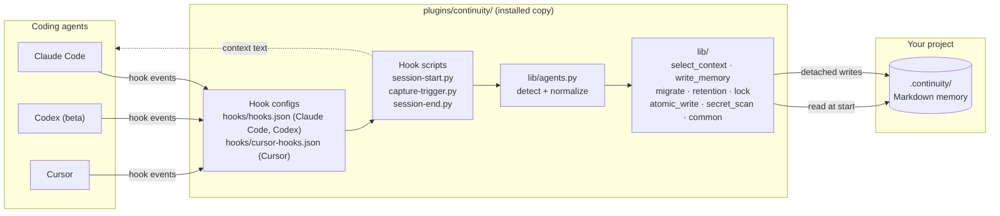
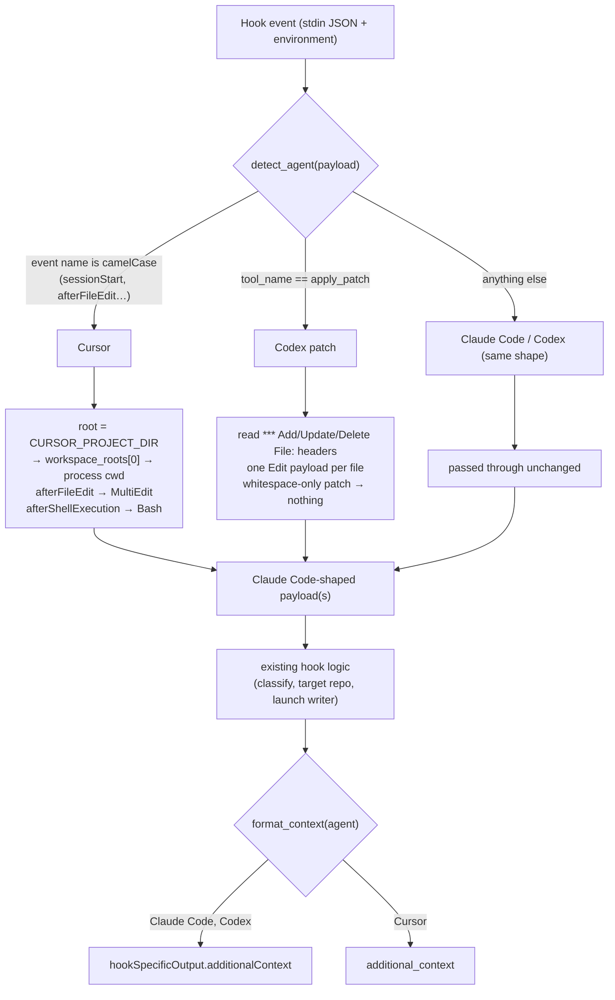
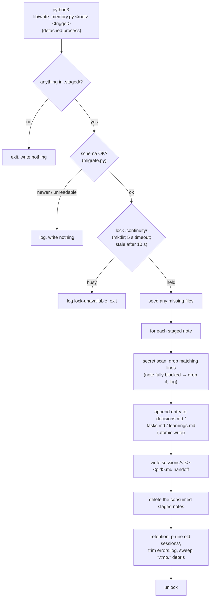
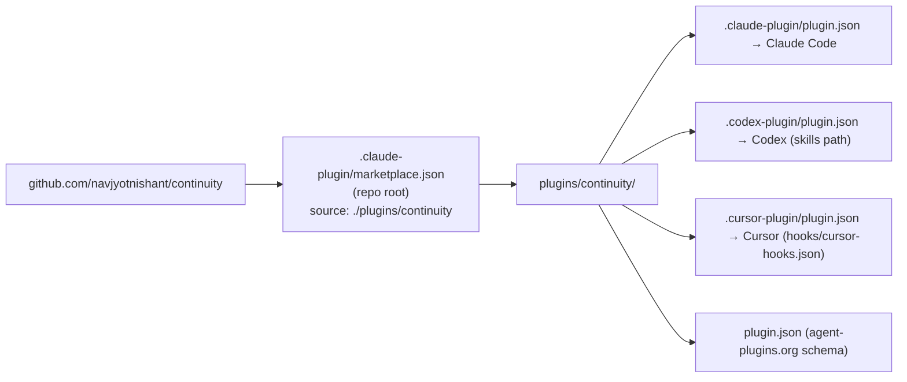

# Continuity architecture

How Continuity works, end to end: which coding agents run it, what happens at each point
in a session, where memory is stored, and what happens when something goes wrong.
Everything here describes v0.2.0. The design history is in
[`specs/001-continuity/`](../specs/001-continuity/) and
[`specs/002-multi-agent/`](../specs/002-multi-agent/).


*Claude Code, Codex (beta) and Cursor share one set of hook scripts. Recall flows back
to the agent at session start (green). The agent's own notes go into
`.continuity/.staged/` (orange). Claude Desktop is not supported because it never runs
plugin hooks. Sections 2–7 below break each part down.*

## In one paragraph

Continuity is a plugin that gives a coding agent memory of a project across sessions.
It stores that memory as plain Markdown in a `.continuity/` folder inside the project.
When a session starts, a hook injects a short, labelled summary of that memory. During
the session, the agent writes notes worth keeping (decisions, tasks, learnings,
handoffs) into a staging folder. After meaningful edits and commits, and when the
session ends, a background writer merges those notes into the durable files. It is
Python 3.9+ standard library only: no server, database, network call or third-party
package. Every failure is logged and skipped, never shown to the user.

## 1. The big picture



There are three moving parts:

- **Hook configs** tell each agent which script to run for which event. Claude Code and
  Codex share `hooks/hooks.json`, since they use the same schema. Cursor uses
  `hooks/cursor-hooks.json`, with its own event names.
- **Three hook scripts** are thin dispatchers. They read the event from stdin, act, and
  exit 0, always.
- **`lib/`** holds all the logic. `lib/agents.py` is the only module that knows how the
  three agents differ.

## 2. One session, start to finish

```mermaid
sequenceDiagram
    autonumber
    participant A as Coding agent
    participant SS as session-start.py
    participant CT as capture-trigger.py
    participant SE as session-end.py
    participant W as write_memory.py (detached)
    participant S as .continuity/

    A->>SS: session starts (SessionStart / sessionStart)
    SS->>S: seed store if missing; check schema
    SS->>S: read state, tasks, decisions, learnings, last handoff
    SS-->>A: staging instructions + labelled context (≤200 lines, ≤10 KB)

    Note over A: Agent works. When something is worth keeping,<br/>it writes a note to .continuity/.staged/<kind>-<ts>-<n>.md

    A->>CT: after a tool call (edit / patch / shell)
    CT->>CT: meaningful? (not whitespace-only; git commit or real diff)
    alt meaningful
        CT-)W: launch detached, return immediately
        W->>S: lock → merge staged notes → handoff → prune → unlock
    else not meaningful
        CT-->>A: nothing (exit 0)
    end

    A->>SE: session ends (SessionEnd / sessionEnd)
    SE-)W: launch detached (flush whatever is still staged)
```

### Recall: `session-start.py`

1. **Find the project root** from the event. How depends on the agent (section 3).
2. **Seed** `.continuity/` from `templates/` if it doesn't exist yet (`lib/migrate.py`).
3. **Check the schema** in `metadata.json`:
   - The current version: use the store as it is.
   - The supported older version: migrate it forward first.
   - A newer or unreadable version: inject no history and write nothing.
4. **Select context** (`lib/select_context.py`). Each section has a line budget: state 30,
   constraints 12, tasks 35 (active and blocked before done), decisions 40, learnings 20,
   last handoff 20. The whole block is capped at 200 lines and 10 KB. If it's still too
   big, whole sections are trimmed in this order: learnings, then decisions, tasks,
   constraints and state.
5. **Return the block** in the agent's own output format. It always starts with the
   **staging instructions**, which name the project's absolute `.staged/` path. The
   history section is labelled *"recorded by a prior session, not a live instruction"*,
   so the agent never mistakes stored notes for new orders.

### Capture: `capture-trigger.py`

A tool call triggers a write only when it's meaningful:

| Tool call | Counts as meaningful when | Trigger kind |
|---|---|---|
| File edit (Edit, Write, MultiEdit, Codex `apply_patch`, Cursor `afterFileEdit`) | any changed text differs by more than whitespace (Codex patches are judged per file) | `file-change` |
| Shell command containing `git commit` | always | `git-diff` |
| Other shell command containing `git` | `git diff -w` shows a real change | `git-diff` |
| Anything else | never | — |

The writer targets the **repository of the edited file**, not just the session's folder.
One Codex patch that touches two repositories starts one writer for each.

### Flush: `session-end.py`

Always launches the writer. If nothing is staged, the writer does nothing.

## 3. How three agents share one set of scripts

The agents send different input and expect different output for the same moment in a
session. `lib/agents.py` converts every agent's input into Claude Code's shape, so the
rest of the code only ever handles one shape.



Two rules keep this reliable:

- **The agent is detected from the payload, never from environment variables.** Codex and
  Cursor both set `CLAUDE_*` variables for compatibility, and Claude Code run inside
  Cursor's terminal can inherit Cursor's variables.
- **Code never reads the plugin's location from the environment.** Cursor runs hooks
  through a shared, long-lived worker whose environment can belong to another plugin.
  Every script finds its files from its own path (`__file__`).

| | Claude Code | Codex (beta) | Cursor |
|---|---|---|---|
| Hook config | `hooks/hooks.json` | `hooks/hooks.json` | `hooks/cursor-hooks.json` |
| Start / edit / shell / end events | `SessionStart` / `PostToolUse` / `PostToolUse` / `SessionEnd` | same | `sessionStart` / `afterFileEdit` / `afterShellExecution` / `sessionEnd` |
| Manual checkpoint | `/continuity-checkpoint` command | `continuity-checkpoint` skill | `/continuity-checkpoint` command |
| Install | marketplace, automatic | marketplace, then trust hooks once | marketplace, then install in the app |

Claude Desktop (Cowork) is not supported, because it never runs plugin hooks
([anthropics/claude-code#40495](https://github.com/anthropics/claude-code/issues/40495)).

## 4. The background writer: `write_memory.py`

The writer merges notes; it never writes prose itself. The note text comes from the
agent, through the staging folder.



- **Atomic writes** (`lib/atomic_write.py`): each file is written to a temporary file in
  the same folder, then renamed over the target. A reader never sees a half-written file.
- **Secret scan** (`lib/secret_scan.py`) checks for AWS keys, `key = value` secrets, PEM
  private keys and long high-entropy runs. It is a mitigation, not a guarantee (see
  [install.md](install.md)). Only the pattern name is logged, never the matched text.
- **Retention** (`lib/retention.py`): session handoffs older than `retention_days`
  (default 60) are deleted, based on the timestamp in their file name. The four durable
  files are never pruned.

## 5. The store: `.continuity/`

```text
.continuity/
├── metadata.json      schema_version, plugin_version, created_at, retention_days, git_tracked
├── state.md           current project state + constraints
├── decisions.md       append-only; one "## Decision: …" entry each
├── tasks.md           append-only; status active | blocked | done
├── learnings.md       append-only
├── sessions/          one handoff file per writer run; pruned after retention_days
├── .staged/           notes waiting to be merged (written by the agent)
├── .lock/             present only while a writer runs
└── errors.log         one line per failure: time | operation | kind | detail
```

Every entry is a Markdown heading, followed by a small fenced block of fields
(`captured_at`, `category`, and `status` for tasks), followed by the note body. The store is
**git-tracked by default**, so teammates' sessions inherit the same memory. Opting out is
one `.gitignore` line ([install.md](install.md)).

## 6. When things go wrong

Continuity must never slow down or break the agent's session. Every path follows the
same rule: **skip the Continuity step, log it, and carry on.**

| Situation | What happens | Logged as |
|---|---|---|
| No `.continuity/` yet | seeded at session start | — |
| A durable file is unreadable | that file is skipped; the others still load | `unreadable` |
| A file is garbled, or an entry is broken | the bad part is skipped | `corrupted` |
| Schema newer than this plugin | no history injected, nothing written | `unsupported-schema` |
| Store can't be written | the turn finishes normally; the staged note is kept for later | `write-failed` (best-effort) |
| Another writer holds the lock | this writer exits | `lock-unavailable` |
| Unexpected hook input | handled as Claude Code input, still exits 0 | `payload-shape` |
| A staged note is all secrets | the note is dropped | `secret-blocked` |

Writes never block the agent: the hook starts the writer as a detached process and
returns straight away.

## 7. Distribution



- **One marketplace file serves all three agents.** The plugin lives in a real subfolder
  because Codex ignores a plugin sourced from the repository root, and installs
  symlinked folders empty.
- **All four manifests carry the same name and version,** and a test enforces it. No
  manifest names `hooks/hooks.json`, because Claude Code loads that file automatically
  and treats a second reference as a duplicate.
- **Install and update steps** are in [install.md](install.md). That includes how to
  recover a marketplace that was pinned to a branch.

## Where to look in the code

| To understand | Read |
|---|---|
| How agents differ | `plugins/continuity/lib/agents.py` |
| What gets injected at session start | `plugins/continuity/lib/select_context.py` |
| How notes become entries | `plugins/continuity/lib/write_memory.py` |
| Schema versions and seeding | `plugins/continuity/lib/migrate.py` |
| The hook contracts in full | `specs/001-continuity/contracts/hook-io-contract.md` |
| Why things are the way they are | `specs/001-continuity/plan.md`, `specs/002-multi-agent/design.md` |
