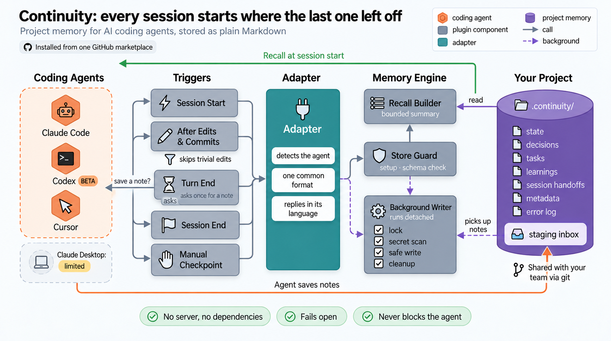
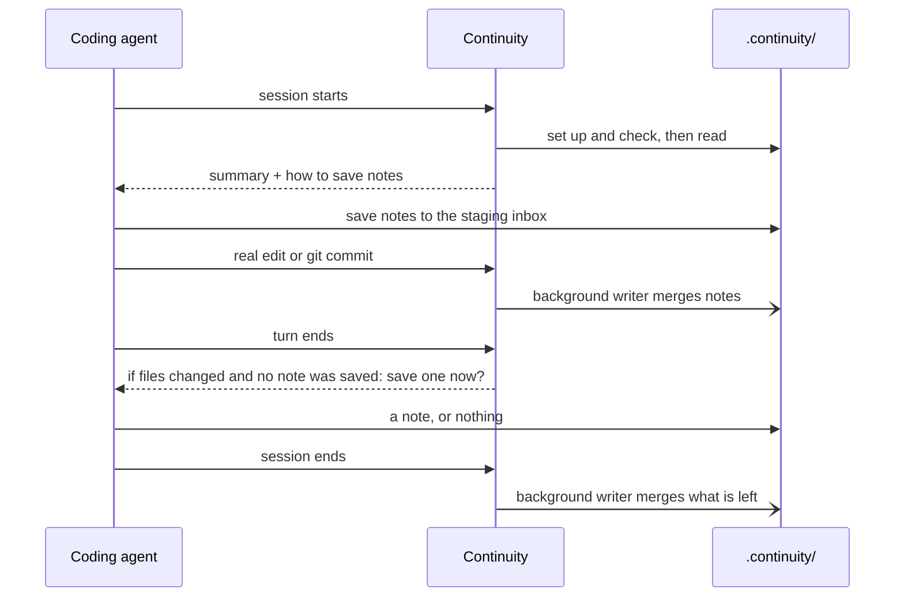
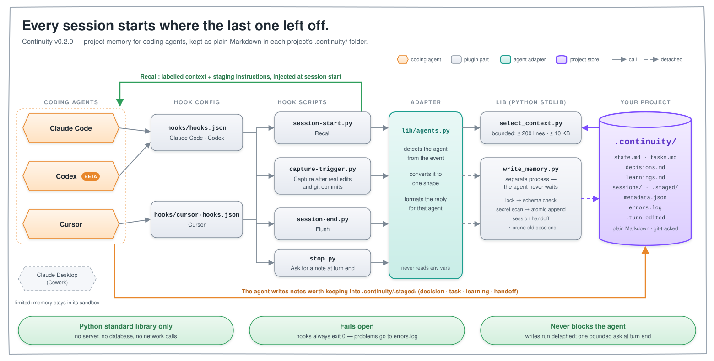

# Continuity architecture

Continuity gives a coding agent memory of a project across sessions. It stores that
memory as plain Markdown in a `.continuity/` folder inside the project, and works in
Claude Code, Codex (beta) and Cursor.



## How it works

1. **Recall at session start.** Continuity sets up `.continuity/` if it's missing, checks
   the store is a version it understands, and gives the agent a short summary of what
   past sessions recorded. The summary is at most 200 lines or 10 KB. It also tells the
   agent how to save new notes.
2. **The agent saves notes.** When something is worth keeping (a decision, a task, a
   learning, or where it left off), the agent writes a small note into the **staging
   inbox**, `.continuity/.staged/`.
3. **Capture after real changes.** After a real edit or a git commit, Continuity starts a
   **background writer**. The writer picks the notes up from the inbox, removes anything
   that looks like a secret, and merges them into the memory files. Whitespace-only edits
   don't trigger it.
4. **Ask at the end of a turn.** If a turn changed files and the agent saved no note,
   Continuity asks it once, before the turn ends, to save one, or nothing if the change
   speaks for itself. It never asks twice in a turn, and never after a turn without
   changes. Claude Code and Codex continue the same turn; Cursor gets an automatic
   follow-up message.
5. **Flush at session end.** The writer runs once more, so nothing staged is left behind.
   You can also save at any time with the checkpoint command (the `continuity-checkpoint`
   skill in Codex).



## The pieces

| Piece | What it does |
|---|---|
| **Triggers** | Session start, after edits and commits, the end of each turn, session end, and the manual checkpoint. |
| **Adapter** | Each agent reports events in its own format. The adapter works out which agent is calling and converts the event into one common format, so everything after it is shared. |
| **Store guard** | Creates `.continuity/` on first use, and checks its schema version before any read or write. |
| **Recall builder** | Picks the most useful recent entries (active tasks first) and trims the summary to fit its limit. |
| **Background writer** | Runs as a separate process, so the agent never waits. It locks the store, scans for secrets, writes files safely (never half-written), writes a session handoff, and cleans up old handoffs. |

## Supported agents

| | Claude Code | Codex (beta) | Cursor |
|---|---|---|---|
| Install | from the marketplace | from the marketplace, then trust the hooks once | from the marketplace, then install in the app |
| Manual save | `/continuity-checkpoint` | `continuity-checkpoint` skill | `/continuity-checkpoint` |

Claude Desktop (Cowork) is **limited to the Cowork workspace**. Its hooks do run, but
in a cloud container whose working directory is `/home/claude`, so the store is created
there, not in the folder you connected. The container is reset between sessions, so a
new session starts with an empty store (tested 2026-10-08). Local Cowork and the
desktop app's Code tab are untested.
Codex is beta because it hasn't yet been verified in a live Codex session. All three
install from the same GitHub marketplace; see [install.md](install.md).

## The store

```text
.continuity/
├── state.md          current state of the project
├── decisions.md      decisions and why they were made
├── tasks.md          tasks: active, blocked or done
├── learnings.md      things worth not re-discovering
├── sessions/         one handoff per session; old ones are cleaned up (default 60 days)
├── .staged/          the staging inbox: notes waiting to be merged
├── .turn-edited      marker: this turn changed files and no note was saved yet
├── metadata.json     schema version and settings
└── errors.log        anything that went wrong
```

New entries are added to the end of each memory file, and earlier ones are kept. By default the
folder is committed with the project, so teammates' sessions share the same memory. To
keep it local instead, add one line to `.gitignore` ([install.md](install.md)).

## When something goes wrong

Continuity must never slow down or break the agent's session. If any step fails, it
skips that step, notes it in `.continuity/errors.log`, and the session carries on.

| Situation | What happens |
|---|---|
| No `.continuity/` yet | it's created at session start |
| A memory file is unreadable or garbled | that file is skipped; the rest still load |
| The store was written by a newer version | nothing is read or written |
| The store can't be written | the session carries on, and the note waits in the inbox |
| A note contains only secrets | it's dropped |

## Design rules

- **Nothing to install or run.** Python standard library only: no server, no database,
  no network calls, no third-party packages.
- **Fails open.** Problems are logged, never shown to the user.
- **Never blocks the agent.** Every write happens in a background process. The one
  pause is the end-of-turn request for a note: at most once per turn, only after a turn
  that changed files.

## Where to look in the code

Everything lives in [`plugins/continuity/`](../plugins/continuity/):

| Piece | Code |
|---|---|
| Triggers | `hooks/`, including `stop.py` for the end-of-turn request (`hooks.json` for Claude Code and Codex, `cursor-hooks.json` for Cursor) |
| Adapter | `lib/agents.py` |
| Store guard | `lib/migrate.py` |
| Recall builder | `lib/select_context.py` |
| Background writer | `lib/write_memory.py`, with `lock.py`, `secret_scan.py`, `atomic_write.py` and `retention.py` |

Design history: [`specs/001-continuity/`](../specs/001-continuity/) (the original design)
and [`specs/002-multi-agent/`](../specs/002-multi-agent/) (Codex and Cursor support).

<details>
<summary>Code-level diagram</summary>



</details>
